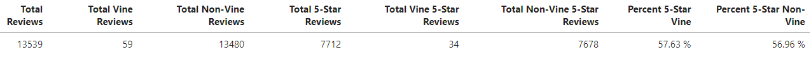

# Amazon_Vine_Analysis
## Overview of Analysis
In this project, an analysis of Amazon product reviews was performed using PySpark, Amazon Web Services: Relational Database Service (AWS RDS), PostgreSQL, and the Pandas library.  

The purpose of the analysis is to understand the differences and potential biases between the Amazon reviews conducted by customers who are part of the Amazon Vine program versus those who are not part of the Amazon Vine program. The Amazon Vine program is a service that allows manufacturers and publishers to receive reviews for their products. Companies can pay a small fee to Amazon and provide products to Amazon Vine members, who are then required to publish a review.  

The dataset used was on reviews for musical instruments, and was obtained from an [Amazon reviews webpage](https://s3.amazonaws.com/amazon-reviews-pds/tsv/index.txt) containing datasets for different categories of products. 

An ETL process was performed on the dataset by performing the following steps: 

1) Extract the dataset using PySpark and convert to a dataframe.
2) Create new dataframe from the original that follow the schema that we want for table that the data will go in on PostgreSQL (pgAdmin 4). Note that the PostgreSQL server is connected to an AWS RDS to avoid using local storage.
3) Import dataframes into pgAdmin 4 to populate the table schema. 
4) Export the table containing review data from pgAdmin 4 as csv files that was read into a Python jupyter notebook using Pandas.
5) An analysis was performed using Pandas to determine bias between Amazon Vine product reviews versus non-Amazon Vine reviews. 
## Results
The following Pandas dataframe summarizes the Amazon Vine product reviews and non-Amazon Vine reviews. The dataframe was made by applying filters to the original dataframe that was read-in from the csv file and creating variables containing numeric information regarding the reviews that were put into the summary dataframe: 

  

The following questions were addressed in the summary dataframe above:
* How many Vine reviews and non-Vine reviews were there? 

    Out of the 13529 Amazon reviews on musical instruments, 13480 were non-Vine program reviews and 59 were made by those part of Amazon Vine. 

* How many Vine reviews were 5 stars? How many non-Vine reviews were 5 stars? 

    34 of the Vine reviews were 5 stars and 7678 of the non-Vine reviews were five stars. 

* What percentage of Vine reviews were 5 stars? What percentage of non-Vine reviews were 5 stars? 

    The percent of Vine reviews that were 5 stars is 57.63 %, and the percent of non-Vine reviews is 56.96 %.  

## Summary
Since the percent of Vine reviews that were 5 stars is 57.63 %, and the percent of non-Vine reviews is 56.96 %, there does not seem to be any bias with those that are part of the Amazon Vine program.  

A possible additional analysis that can be done is analyzing all of the star ratings, particularly one-star ratings could be of value since there is a chance that Amazon Vine reviewers might not want to leave as many poor reviews.